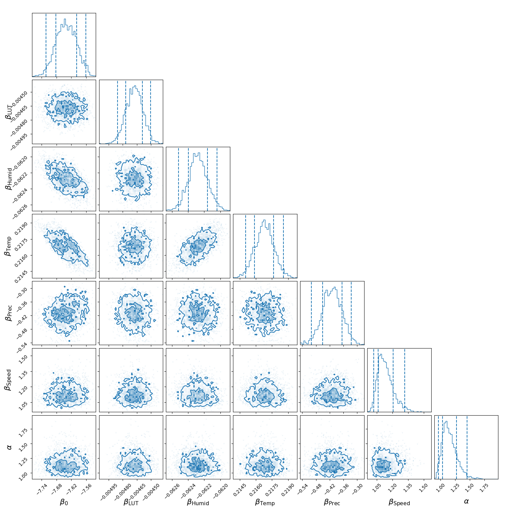
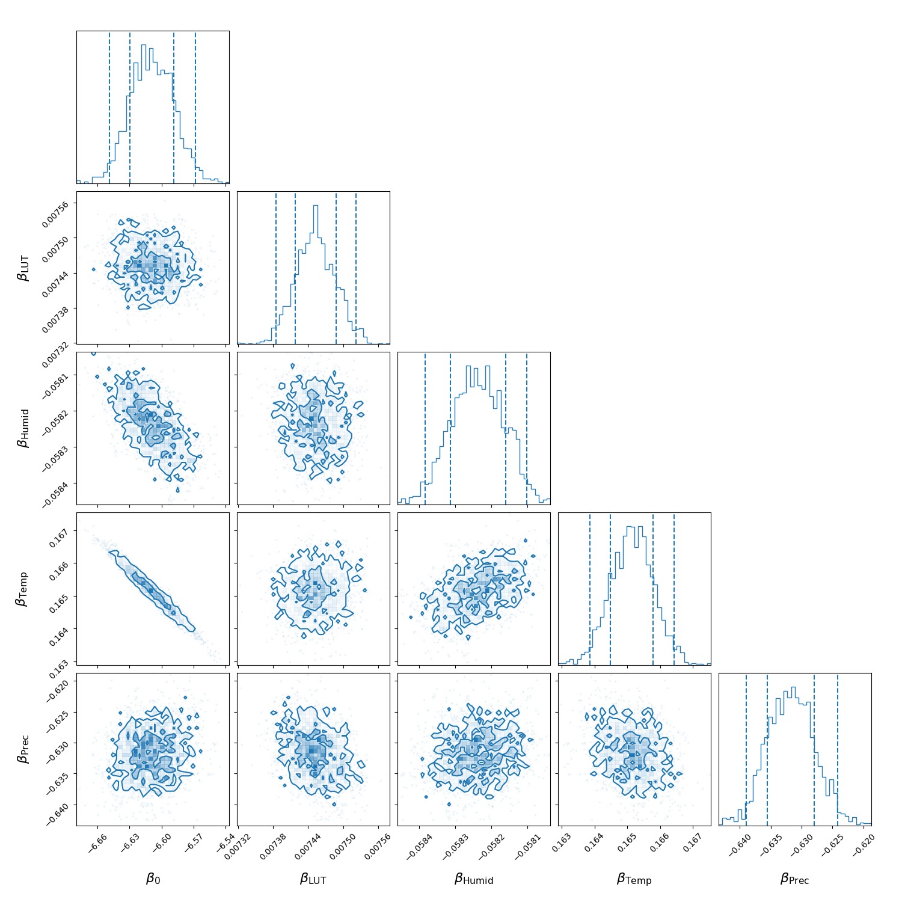
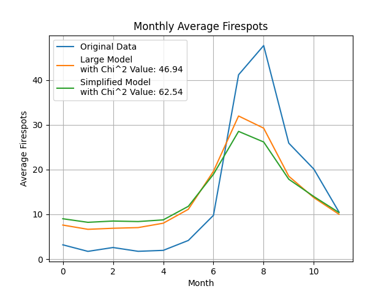

This project employs Bayesian statistical methods to investigate the spatio-temporal dynamics of fire spots in the Amazonia biome over a 12-year period (2011–2022). Bayesian analysis allows for the integration of diverse data sources, handling uncertainty and variability inherent to complex ecological systems. By incorporating meteorological variables and land-use transitions, the report identifies key drivers of wildfire activity and provides robust insights into the patterns and mechanisms underlying fire dynamics.ct analyzes the spatio-temporal dynamics of fire spots in the Amazonia biome over a 12-year period (2011–2022) using Bayesian statistics. By incorporating meteorological variables and land-use transitions, the analysis reveals critical insights into wildfire patterns and their driving factors.

---

### Disclaimer

This project was conducted as part of the **Bayesian Statistical Methods and Data Analysis HS2024** course at **ETH Zurich**. The analysis is based on the paper:

- **[Bayesian spatio-temporal modeling of the Brazilian fire spots between 2011 and 2022](https://doi.org/10.1038/s41598-024-70082-6)**
  by **Jonatha Sousa Pimentel**, **Rodrigo S. Bulhões**, and **Paulo Canas Rodrigues**.

### Citation:
Pimentel, J.S., Bulhões, R.S. & Rodrigues, P.C. **Bayesian spatio-temporal modeling of the Brazilian fire spots between 2011 and 2022**. *Sci Rep* **14**, 21616 (2024). [https://doi.org/10.1038/s41598-024-70082-6](https://doi.org/10.1038/s41598-024-70082-6).

Their research serves as the foundation for the **spatio-temporal modeling framework** applied in this project.

---

## Overview

### Motivation
- **Wildfires**: Critical environmental issue, exacerbated by climate change.
- **Region**: Brazil, especially Amazonia, home to 60% of the world’s largest rainforest, vital biodiversity, and significant freshwater reserves.
- **Objective**: Use Bayesian frameworks to model fire spots over time and space in Amazonia, incorporating meteorological and anthropogenic factors.

### Data Sources
1. **Fire Spot Data**: Brazilian National Institute for Space Research (INPE), satellite imagery (2011–2022).
2. **Meteorological Data**: Brazilian National Institute of Meteorology (INMET), hourly data (2011–2022).
3. **Land Use Data**: MapBiomas, annual land-use and transitions data (2011–2022).

### Key Features
- 22 million fire spots detected over 12 years across Brazil.
- Focus on 558 municipalities in Amazonia with detailed meteorological and land-use data.

---

## Data and Methods

### Data Characteristics
- **Variables**:
  - Fire counts per municipality per month.
  - Meteorological: Precipitation, temperature, humidity, radiation, wind speed.
  - Anthropogenic: Land-use transitions (e.g., deforestation, agriculture).
- **Size**: 66960 rows (monthly observations) and 9 columns, representing a spatio-temporal dataset.

### Data Cleaning
- Aggregation: Monthly summaries for fire counts and meteorological data.
- Missing Data: Interpolated meteorological values and imputed land-use transitions.
- Challenges: Summarization, coarseness of MODIS resolution, and data imputation.

### Bayesian Model
- **Goal**: Predict fire spot counts using:
  - Meteorological factors (e.g., precipitation, temperature).
  - Land-use transitions.
- **Structure**: Spatio-temporal generalized linear mixed model.
- **Implementation**: Code written in JAX for performance optimization.
- **Likelihood**: Poisson-distributed fire counts.

---
---

## Model Performance

### Modeling Results

#### Large Model
Key meteorological factors contributing to the fire activity were identified with the computation and sampling of the large spatio-temporal model, including the weight matrix.



*Table 1*: Summary of model parameter estimates and their credible intervals.

| **Parameter**   | **Mean**  | **95% CI**            |
|------------------|-----------|-----------------------|
| β₀              | -7.6412   | [-7.7224, -7.5607]    |
| β_{LUT}         | -0.0047   | [-0.0049, -0.0045]    |
| β_{HUMID}       | -0.0623   | [-0.0625, -0.0620]    |
| β_{TEMP}        | 0.2168    | [0.2150, 0.2186]      |
| α               | -0.4099   | [-0.4997, -0.3254]    |
| τ_{int}         | 1.1337    | [1.0193, 1.3190]      |
| τ_{slo}         | 1.1558    | [0.9631, 1.4552]      |
| ρ_{int}         | 0.0396    | [0.0014, 0.1228]      |
| ρ_{slo}         | 0.1134    | [0.0114, 0.3066]      |

#### Simplified Model
For comparison, a simplified model was implemented, which reduces the effective parameter space from 1,121 to 5 by excluding the weight matrix and focusing only on the β and α parameters.



*Table 2*: Summary of model parameter estimates and their credible intervals.

| **Parameter**   | **Mean**  | **95% CI**            |
|------------------|-----------|-----------------------|
| β₀              | -6.6091   | [-6.6490, -6.5683]    |
| β_{LUT}         | 0.0075    | [0.0074, 0.0075]      |
| β_{HUMID}       | -0.0582   | [-0.0584, -0.0581]    |
| β_{TEMP}        | 0.1651    | [0.1639, 0.1664]      |
| α               | -0.6317   | [-0.6390, -0.6242]    |

#### Interpretation of Findings
The large hierarchical spatio-temporal model accurately captured the dynamics of fire spots in Amazonia and produced mean estimates and variances comparable to the referenced literature. 

Using WAIC (Widely Applicable Information Criterion), the following results were obtained:

*Table 3*: WAIC results for the Large and Simplified Models.

| **Metric**     | **Large Model** | **Simplified Model** |
|-----------------|-----------------|-----------------------|
| elpd\_waic     | -805,858.52     | -1,208,581.91        |
| p\_waic         | 48,417.23       | 1,807.82             |

The large model has a less negative elpd\_waic (-805,858.52) compared to the simplified model (-1,208,581.91). However, the simplified model demonstrates better performance for its reduced complexity, as indicated by the effective number of parameters (p\_waic).



*Figure 1*: Model predictions versus observed fire activity.

---

## Installation and Usage

### Prerequisites
- Python 3.8+
- Jupyter Notebook for data exploration
- Required Python libraries (see `requirements.txt`)

### Installation
1. Clone the repository:
    ```bash
    git clone https://github.com/nviebig/Bayesian-SpatioTemporal-Modeling.git
    cd Bayesian-SpatioTemporal-Modeling
    ```

2. Install the required Python libraries:
    ```bash
    pip install -r requirements.txt
    ```

---

## Contributors
- **Jan Fritz**: [jfritz@student.ethz.ch](mailto:jfritz@student.ethz.ch)
- **Niklas Viebig**: [nviebig@student.ethz.ch](mailto:nviebig@student.ethz.ch)
- **Luca Titze**: [ltitze@student.ethz.ch](mailto:ltitze@student.ethz.ch)
- **Victor Windhab**: [vwindhab@student.ethz.ch](mailto:vwindhab@student.ethz.ch)

---

## References
This project builds upon the work by:
- Jonatha Sousa Pimentel, Rodrigo S. Bulhões, Paulo Canas Rodrigues.  
  Pimentel, J.S., Bulhões, R.S. & Rodrigues, P.C. **Bayesian spatio-temporal modeling of the Brazilian fire spots between 2011 and 2022**. *Sci Rep* **14**, 21616 (2024). [https://doi.org/10.1038/s41598-024-70082-6](https://doi.org/10.1038/s41598-024-70082-6).

- Image Source: [The Guardian: Brazil Amazon rainforest sees worst fires in a decade](https://www.theguardian.com/environment/2020/oct/01/brazil-amazon-rainforest-worst-fires-in-decade).
---
