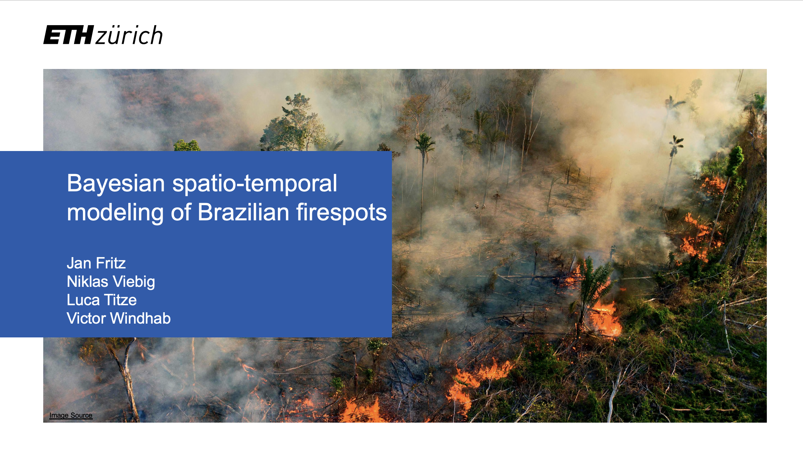

This project analyzes the spatio-temporal dynamics of fire spots in the Amazonia biome over a 12-year period (2011–2022) using Bayesian statistics. By incorporating meteorological variables and land-use transitions, the analysis reveals critical insights into wildfire patterns and their driving factors.

---

### Disclaimer

This project was conducted as part of the **Bayesian Statistical Methods and Data Analysis HS2024** course at **ETH Zurich**. The analysis is based on the paper:

- **[Bayesian spatio-temporal modeling of the Brazilian fire spots between 2011 and 2022](https://doi.org/10.1038/s41598-024-70082-6)**
  by **Jonatha Sousa Pimentel**, **Rodrigo S. Bulhões**, and **Paulo Canas Rodrigues**.

### Citation:
Pimentel, J.S., Bulhões, R.S. & Rodrigues, P.C. **Bayesian spatio-temporal modeling of the Brazilian fire spots between 2011 and 2022**. *Sci Rep* **14**, 21616 (2024). [https://doi.org/10.1038/s41598-024-70082-6](https://doi.org/10.1038/s41598-024-70082-6).

Their research serves as the foundation for the **spatio-temporal modeling framework** applied in this project.

---

## Overview

### Motivation
- **Wildfires**: Critical environmental issue, exacerbated by climate change.
- **Region**: Brazil, especially Amazonia, home to 60% of the world’s largest rainforest, vital biodiversity, and significant freshwater reserves.
- **Objective**: Use Bayesian frameworks to model fire spots over time and space in Amazonia, incorporating meteorological and anthropogenic factors.

### Data Sources
1. **Fire Spot Data**: Brazilian National Institute for Space Research (INPE), satellite imagery (2011–2022).
2. **Meteorological Data**: Brazilian National Institute of Meteorology (INMET), hourly data (2011–2022).
3. **Land Use Data**: MapBiomas, annual land-use and transitions data (2011–2022).

### Key Features
- 22 million fire spots detected over 12 years across Brazil.
- Focus on 558 municipalities in Amazonia with detailed meteorological and land-use data.

---

## Data and Methods

### Data Characteristics
- **Variables**:
  - Fire counts per municipality per month.
  - Meteorological: Precipitation, temperature, humidity, radiation, wind speed.
  - Anthropogenic: Land-use transitions (e.g., deforestation, agriculture).
- **Size**: 66960 rows (monthly observations) and 9 columns, representing a spatio-temporal dataset.

### Data Cleaning
- Aggregation: Monthly summaries for fire counts and meteorological data.
- Missing Data: Interpolated meteorological values and imputed land-use transitions.
- Challenges: Summarization, coarseness of MODIS resolution, and data imputation.

### Bayesian Model
- **Goal**: Predict fire spot counts using:
  - Meteorological factors (e.g., precipitation, temperature).
  - Land-use transitions.
- **Structure**: Spatio-temporal generalized linear mixed model.
- **Implementation**: Code written in JAX for performance optimization.
- **Likelihood**: Poisson-distributed fire counts.

---

## Model Performance

### Evaluation Metrics
- Deviance Information Criterion (DIC) for model comparison.
- Chi-squared goodness-of-fit for assessing model accuracy.

### Key Results
- **Small Model**: Log-likelihood: -25,457,027.72, DIC: 1,304,898.
- **Big Model**: Log-likelihood: -728,709.882, DIC: 1,459,754.219.

### Visualization
- Corner plots of posterior distributions.
- Comparative analysis between models.

---

## Installation and Usage

### Prerequisites
- Python 3.8+
- Jupyter Notebook for data exploration
- Required Python libraries (see `requirements.txt`)

### Installation
1. Clone the repository:
    ```bash
    git clone https://github.com/nviebig/Bayesian-SpatioTemporal-Modeling.git
    cd Bayesian-SpatioTemporal-Modeling
    ```

2. Install the required Python libraries:
    ```bash
    pip install -r requirements.txt
    ```

---

## Contributors
- **Jan Fritz**: [jfritz@student.ethz.ch](mailto:jfritz@student.ethz.ch)
- **Niklas Viebig**: [nviebig@student.ethz.ch](mailto:nviebig@student.ethz.ch)
- **Luca Titze**: [ltitze@student.ethz.ch](mailto:ltitze@student.ethz.ch)
- **Victor Windhab**: [vwindhab@student.ethz.ch](mailto:vwindhab@student.ethz.ch)

---

## References
This project builds upon the work by:
- Jonatha Sousa Pimentel, Rodrigo S. Bulhões, Paulo Canas Rodrigues.  
  Pimentel, J.S., Bulhões, R.S. & Rodrigues, P.C. **Bayesian spatio-temporal modeling of the Brazilian fire spots between 2011 and 2022**. *Sci Rep* **14**, 21616 (2024). [https://doi.org/10.1038/s41598-024-70082-6](https://doi.org/10.1038/s41598-024-70082-6).

- Image Source: [The Guardian: Brazil Amazon rainforest sees worst fires in a decade](https://www.theguardian.com/environment/2020/oct/01/brazil-amazon-rainforest-worst-fires-in-decade).
---
